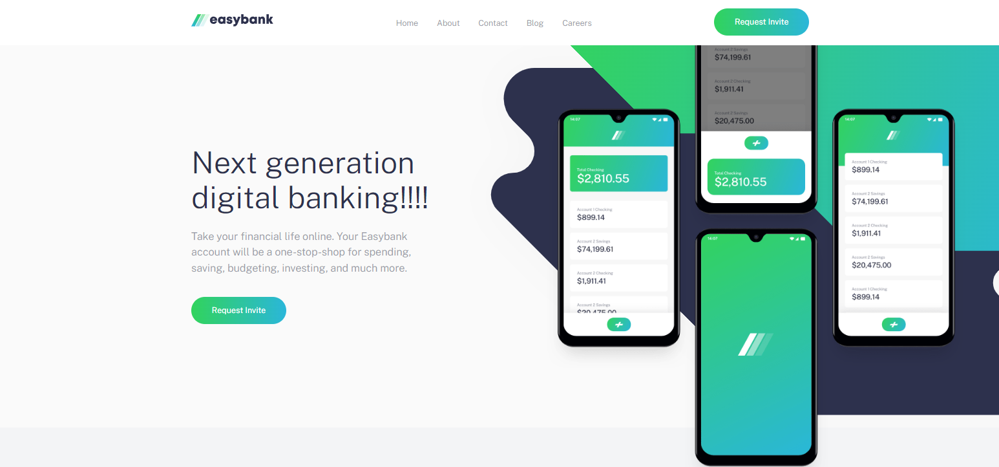
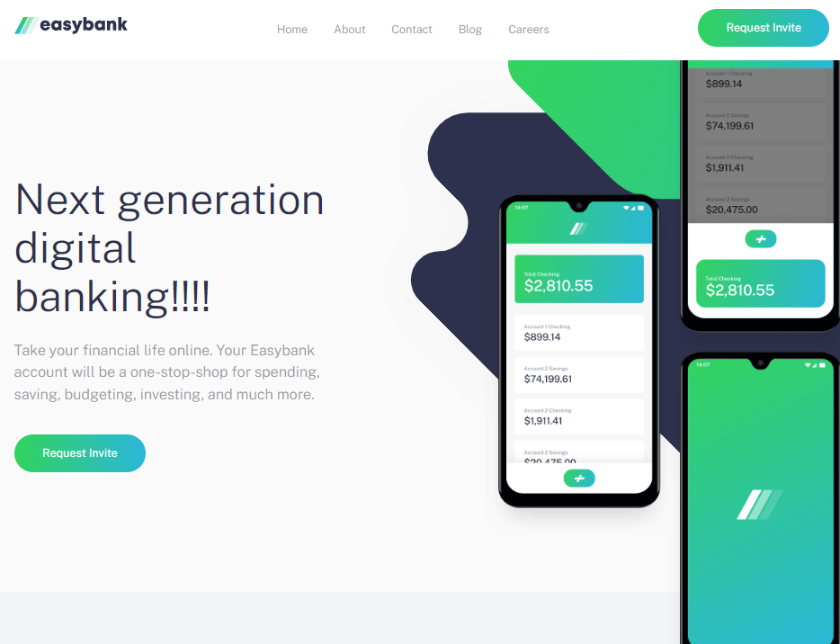
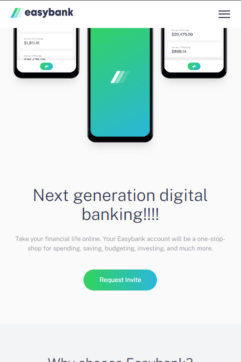
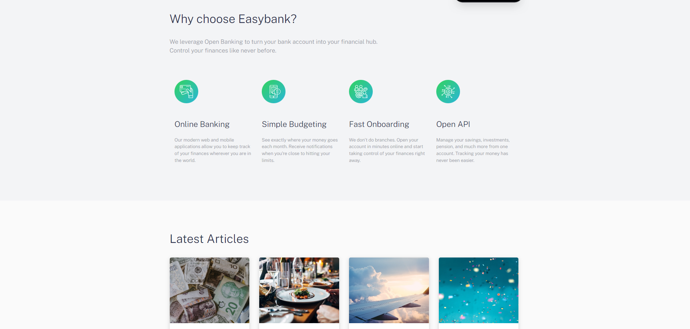
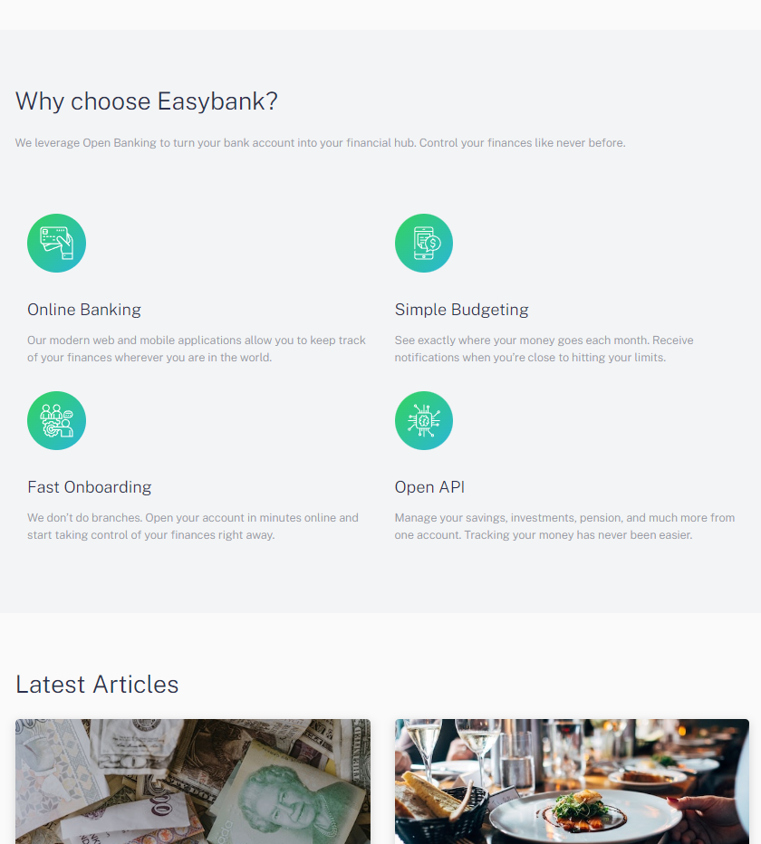
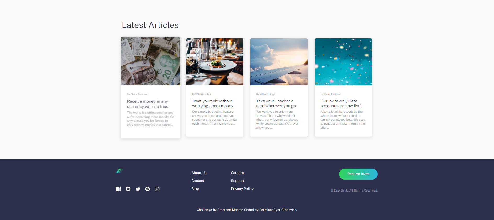
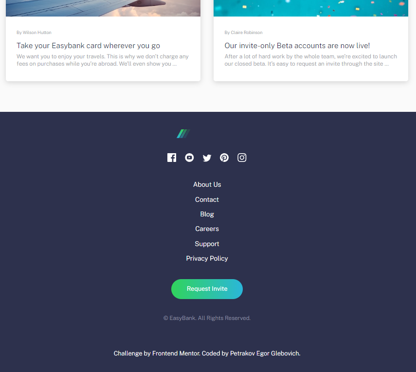

# SCSSLanding - Landing Bank Page

### **Petrakov Egor**

Этот проект направлен на изучение и реализацию адаптивной вёрстки с использованием препроцессора 
SCSS по методологии БЭМ. Цель проекта — углубить понимание SCSS, его возможностей, 
а также применения методологии БЭМ для создания модульного и поддерживаемого кода. 
Макет и дизайн взяты с платформы Frontend Mentor.

## Обзор

Проект состоит из нескольких ключевых секций, каждая из которых 
демонстрирует различные аспекты адаптивной вёрстки и использования SCSS:

### 1. Шапка и Оглавление (Header & Hero Section)
На изображениях показаны шапка и основное оглавление страницы. 
Этот раздел включает в себя навигацию по сайту, 
основной призыв к действию и вводную информацию о содержании.

#### Изображения:
- 
- 
- 

### 2. Статьи и Раздел с функциями (Article & Feature Section)
В этом разделе показаны расположение контента и использование изображений для статей и функциональных блоков. 
Реализованы различные точки для медиазапросов, чтобы улучшить читаемость и обеспечить плавный пользовательский опыт 
на всех устройствах.

#### Изображения:
- 
- 

### 3. Футер (Footer)
Футер завершает страницу и включает ссылки и полезную информацию.

#### Изображения:
- 
- 

## Заключение
Проект SCSSLanding направлен на понимание и применение ключевых концепций современного веб-разработки, а именно:
- Использование SCSS как препроцессора для улучшения разработки стилей.
- Методология БЭМ для структурирования и наименования CSS-классов.
- Адаптивная вёрстка для обеспечения совместимости на различных устройствах.